This is a [Tina CMS](https://tina.io/) starter project.
testing mermaid feature in github markdown 

```mermaid
flowchart TB
  node1[Форма 1]  
  node2(Форма 2)
  node3([Форма 3])
  node4[[Форма 4]]
  node5[(Форма 5)]
  node6((Форма 6))
  node7>Форма 7]
  node8{Форма 8}
  node9{{Форма 9}}
  node10[/Форма 10/]
  node11[\Форма 11\]
  node12[/Форма 12\]
  node13[\Форма 13/]
```

## 🚀 Project Structure
```text
├── README.md
├── astro-tina-directive/
├── astro.config.mjs
├── package.json
├── pnpm-lock.yaml
├── public/
├── src
│   ├── components
│   ├── content
│   ├── content.config.ts
│   ├── layouts
│   ├── pages
│   └── styles
├── tina
│   ├── collections
│   ├── components
│   ├── config.ts
│   ├── pages
│   └── tina-lock.json
└── tsconfig.json
```

Each page is exposed as a route based on its file name which are generated from the content under `src/content/` (excluding the `config` folder). 

**To enable Visual Editing with TinaCMS we have had to use React components and a new `client:tina` Directive. Which is the code located under `astro-tina-directive`. **

Under the `tina/` folder we have, `collections/` which holds our TinaCMS schema definitions. Under `components/` we have a custom Icon Component that is used within the TinaCMS UI. Under `pages/` we have the "wrappers" that make the Visual Editing work, using the `useTina` hook. 

The `pages/index.astro` is the "Home" page - This is a special case and has been setup to look for the `content/page/home.mdx` file. 

There's nothing special about `src/components/`, but that's where we like to put any Astro/React/Vue/Svelte/Preact components.

The `src/content/` directory contains "collections" of related Markdown and MDX documents. Use `getCollection()` to retrieve posts from `src/content/blog/`, and type-check your frontmatter using an optional schema. See [Astro's Content Collections docs](https://docs.astro.build/en/guides/content-collections/) to learn more.
